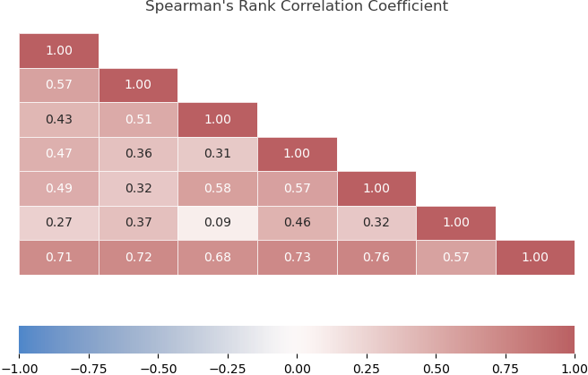

# Feature Importance and Selection

Feature importance refers to a measure of how important each feature/variable is in a dataset to the target variable or the model performance. It can be used to understand the relationships between variables and can also be used for feature selection to optimize the performance of machine learning models.

## Non-Model-Based Feature Importance Measures

Non-model-based feature importance measures determine the importance of each feature by analyzing the data itself, without the need for information about a specific machine learning model. These measures are helpful for understanding the data itself but may not always be useful when building a predictive model.

Some common techniques of non-model-based feature importance measures are:

### Spearman's Rank Correlation Coefficient

Spearman's rank correlation coefficient is a non-parametric measure used to evaluate the strength and direction of the relationship between two variables. The coefficient ranges from -1 to 1, where -1 indicates a perfectly negative correlation and 1 indicates a perfectly positive correlation. The Spearman Rank formula looks like this:

$$\rho=1-\frac{6-\Sigma d^2}{n^3-n}$$
 
where $d$ is the difference between the ranks of each pair of values of the two variables, and $𝑛$ is the number of total pairs.
  
Spearman's rank correlation coefficient works well for independent features but is not applicable when there are codependent variables existing in the dataset.

In this report, we'll use the [Pokemon dataset](https://gist.github.com/armgilles/194bcff35001e7eb53a2a8b441e8b2c6#file-pokemon-csv) to demonstrate different feature importance and selection approaches.

  

The target variable in this dataset is "Total". From the above heatmap, we can see that the variable "Sp. Def" is the most important, and "Speed" is the least important to the target variable.

### Principle Component Analysis (PCA)

Principal Component Analysis is a technique for dimensionality reduction that aims to identify patterns in the data that can be explained by fewer variables or dimensions. PCA calculates the principal components, which are the linear combinations of the variables that capture the maximum amount of variance in the data.

The PCA algorithm works as follows:

1. Center each column vector to create the centered matrix.
2. Calculate the sample covariance matrix.
3. Calculate the Eigendecomposition.

From the scree plot, we can observe that if we choose K=4, about 90% of the variation present in the initial data could be recreated.

### Minimum Redundancy Maximum Relevance (mRMR)

To deal with codependencies, we can apply Minimum Redundancy Maximum Relevance (mRMR) for feature importance and selection. The main idea behind mRMR is to identify the most important features in a dataset by maximizing the mutual information between the features and the target variable while minimizing the redundancy between the features.

mRMR works well for feature selection, but it can be computationally expensive for large datasets.

The top 6 important features identified using mRMR in this dataset are: 'Sp. Atk', 'Defense', 'Speed', 'HP', 'Attack', 'Sp. Def'.

## Model-Based Feature Importance Measures

Model-based feature importance measures are techniques used to evaluate the importance of each feature in a dataset for predicting the target variable. These measures quantify the contribution of each feature to the performance of the training model.

Some common techniques of model-based feature importance measures are:

### Lasso Regression

Least Absolute Shrinkage and Selection Operator (LASSO) is a popular and interpretable model-based feature selection technique. It selects the most important features in a dataset by shrinking the coefficients of less important features to zero. LASSO adds a penalty term to the traditional regression loss function.

The top 6 important features identified using Lasso Regression in this dataset are: 'Sp. Atk', 'Attack', 'Sp. Def', 'Defense', 'Speed', 'HP'.

### Permutation Importance

Permutation Importance is a model-agnostic feature importance approach that can be applied to any type of

.
