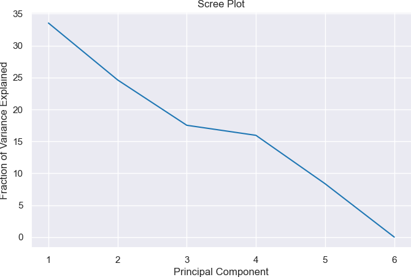
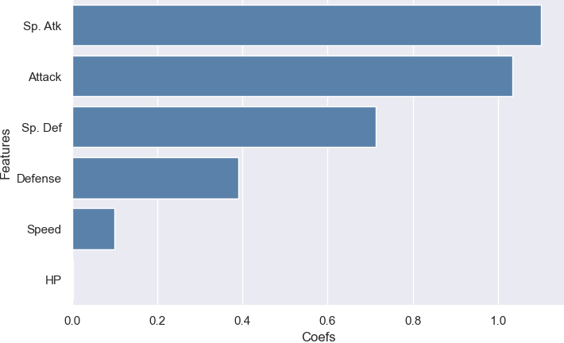
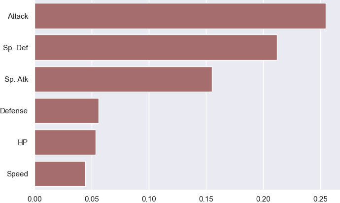

# Feature Importance and Selection

[](https://opensource.org/licenses/MIT)

Feature importance refers to a measure of how important each feature/variable is in a dataset to the target variable or the model performance. It can be used to understand the relationships between variables and can also be used for feature selection to optimize the performance of machine learning models.

In this report, we'll use the [Pokemon dataset](https://gist.github.com/armgilles/194bcff35001e7eb53a2a8b441e8b2c6#file-pokemon-csv) to demonstrate different feature importance and selection approaches.
<p align="left">
  
</p>

## Files
`featimp.py`: This file contains several functions for data analysis and feature importance evaluation. Here's a brief explanation of each function:

- `dataset(file_path="pokemon.csv")`: Reads a CSV file and returns a DataFrame, predictor variables, and target variable extracted from the DataFrame.

- `spearman_correlation(df)`: Computes the Spearman's rank correlation coefficient matrix for a given DataFrame. It creates a heatmap plot to visualize the correlation matrix.

- `pca_plot(X)`: Performs Principal Component Analysis (PCA) on the given predictor variables. It calculates the explained variance ratio for each principal component and plots the scree plot.

- `mRMR(X, y, k)`: Applies the minimum Redundancy Maximum Relevance (mRMR) algorithm to select the top k features based on their relevance to the target variable.

- `lasso_plot(X, y, lmbda=900)`: Performs Lasso regression on the predictor variables and the target variable. It plots the coefficients (importances) of the features using a bar plot.

- `rf_permutation(X, y)`: Applies the Random Forest permutation importance method to estimate the feature importances for the predictor variables and the target variable. It plots the feature importances using a bar plot.

## Dependencies

The following libraries are required to run the functions:

- `pandas`
- `numpy`
- `scipy`
- `sklearn`
- `matplotlib`
- `seaborn`
- `mrmr`

Please make sure to install these dependencies before using the functions or install the required dependencies by running the following command:
```bash
$ pip install -r requirements.txt
```

## Non-Model-Based Feature Importance Measures

Non-model-based feature importance measures determine the importance of each feature by analyzing the data itself, without the need for information about a specific machine learning model. These measures are helpful for understanding the data itself but may not always be useful when building a predictive model.

Some common techniques of non-model-based feature importance measures are:

### Spearman's Rank Correlation Coefficient

Spearman's rank correlation coefficient is a non-parametric measure used to evaluate the strength and direction of the relationship between two variables. The coefficient ranges from -1 to 1, where -1 indicates a perfectly negative correlation and 1 indicates a perfectly positive correlation. The formula for Spearman's rank correlation coefficient is as follows:

$$\rho=1-\frac{6-\Sigma d^2}{n^3-n}$$
 
where $d$ is the difference between the ranks of each pair of values of the two variables, and $𝑛$ is the number of total pairs.
  
Spearman's rank correlation coefficient works well for independent features but is not applicable when there are codependent variables existing in the dataset.

```python
from featimp import *

df, X, y = dataset('pokemon.csv')
spearman_correlation(df)
```


The target variable in this dataset is "Total". From the above heatmap, we can see that the variable "Sp. Def" is the most important, and "Speed" is the least important to the target variable.

### Principle Component Analysis (PCA)

Principal Component Analysis is a technique for dimensionality reduction that aims to identify patterns in the data that can be explained by fewer variables or dimensions. PCA calculates the principal components, which are the linear combinations of the variables that capture the maximum amount of variance in the data.

The PCA algorithm works as follows:
1. Center each column vector to create the centered matrix.
   $$X^C=\\{x_{i,j}^C\\}_{i,j}$$

2. Calculate the sample covariance matrix.
   $$S=\frac{1}{n-1}{X^C}^TX^C$$
   
3. Calculate the Eigendecomposition.
   $$S=\Phi\Lambda\Phi^T$$

The eigenvectors (columns of $\Phi$) represent the principal components, and the eigenvalues (diagonal entries of $\Lambda$) represent the amount of variance that each principal component captures. The eigenvectors are then used to project the original dataset to a lower-dimensional space.

```python
pca_plot(X)
```
Output:
```
array([ 33.54563919,  58.1734392 ,  75.69537093,  91.64097116,
       100.        , 100.        ])
```


From the scree plot, we can observe that if we choose K=4, about 90% of the variation present in the initial data could be recreated.

### Minimum Redundancy Maximum Relevance (mRMR)

To deal with codependencies, we can apply Minimum Redundancy Maximum Relevance (mRMR) for feature importance and selection. The main idea behind mRMR is to identify the most important features in a dataset by maximizing the mutual information between the features and the target variable while minimizing the redundancy between the features.

$$mRMR=\max[I(x_k,y)-\frac{1}{|S|}\Sigma_{x_j\in S}I(x_k, x_j)]$$

mRMR works well for feature selection, but it can be computationally expensive for large datasets.

```python
k = 6
print(f'Top {k} important features: {mRMR(X, y, k)}')
```
Output:
```
Top 6 important features: ['Sp. Atk', 'Defense', 'Speed', 'HP', 'Attack', 'Sp. Def']
```

We can see that by using mRMR, the most important feature in this dataset is also "Sp. Atk", which is the same as the result of Spearman's rank correlation coefficient, but the least important feature is "Sp. Def" this time.

## Model-Based Feature Importance Measures

Model-based feature importance measures are techniques used to evaluate the importance of each feature in a dataset for predicting the target variable by measuring the contribution of each feature to the performance of the training model.

It can be useful for identifying the most important features in a dataset, however, it can also be sensitive to the choice of models and hyperparameters. Therefore, it is important to use several different feature importance techniques at the same time and evaluate their performance by using different models and datasets.

Some common techniques of model-based feature importance measures are given and explained below:

### Lasso Regression

Least Absolute Shrinkage and Selection Operator (LASSO) is a popular and easily interpretable model-based feature selection technique that select the most important features in a dataset by shrinking the coefficients of less important features to zero.

It works by adding a penalty term to the traditional regression loss function:

$$\beta_{LASSO}=argmin_\beta\Sigma^N_{i=1}(y_i-\Sigma^M_{j=1}x_{ij}\beta_j^2)+\lambda\Sigma^M_{j=1}|\beta_j|$$

where $\lambda$ is the regularization paramter.

The penalty term is proportional to the absolute value of the coefficients of the features, therefore the coefficients of the less important features might be set to zero.

LASSO is useful and can handle high-dimensional datasets with many features, however, it can also be sensitive to the choice of regularization parameter.

```python
print(f'Top 6 important features: {lasso_plot(X, y)}')
```
Output:
```
Top 6 important features: ['Sp. Atk', 'Attack', 'Sp. Def', 'Defense', 'Speed', 'HP']
```


### Permutation Importance

Permutation Importance is a model-agnostic feature importance approach that can be applied to any type of machine learning model. It select important features by measuring the decrease in the performance of a model when a feature is randomly permuted in the test data.

If a feature is important for predicting the target variable, shuffling the values of that feature should reduce the performance of the model. Conversely, if a feature is not important, shuffling the values of that feature should have little effect on the performance of the model.

Permutation Importance is less sensitive to the presence of codependent features, but it can be computationally expensive, especially for large datasets.

To calculate permutation importance, we follow these steps:

1. Train a machine learning model on the dataset.
2. Evaluate the model's performance on a validation set.
3. Select a feature and randomly permute its values in the validation set.
4. Calculate the predictions using the permuted validation set.
5. Measure the decrease in performance compared to the original predictions.
6. Repeat steps 3-5 multiple times to get an average importance score for the feature.

```python
print(f'Top 6 important features: {rf_permutation(X, y)}')
```
Output:
```
Top 6 important features: ['Attack', 'Sp. Def', 'Sp. Atk', 'Defense', 'HP', 'Speed']
```


## Conclusion

In this report, we explored both non-model-based and model-based feature importance measures. Non-model-based measures like Spearman's rank correlation coefficient and PCA provide insights into the relationships and patterns present in the data. On the other hand, model-based measures like Lasso Regression and Permutation Importance quantify the importance of features for predicting the target variable.

It's important to note that different feature importance measures may yield different results. The choice of which measure to use depends on the specific goals and requirements of the analysis or modeling task.

By understanding the importance of features in a dataset, we can make informed decisions about feature selection, which can lead to improved model performance and a better understanding of the underlying relationships in the data.

## License

This project is licensed under the [MIT License](LICENSE).

## Acknowledgments
The project structure is adapted from the MSDS 689 course materials provided by the University of San Francisco (USFCA-MSDS). Special thanks to the course instructors for the inspiration.
